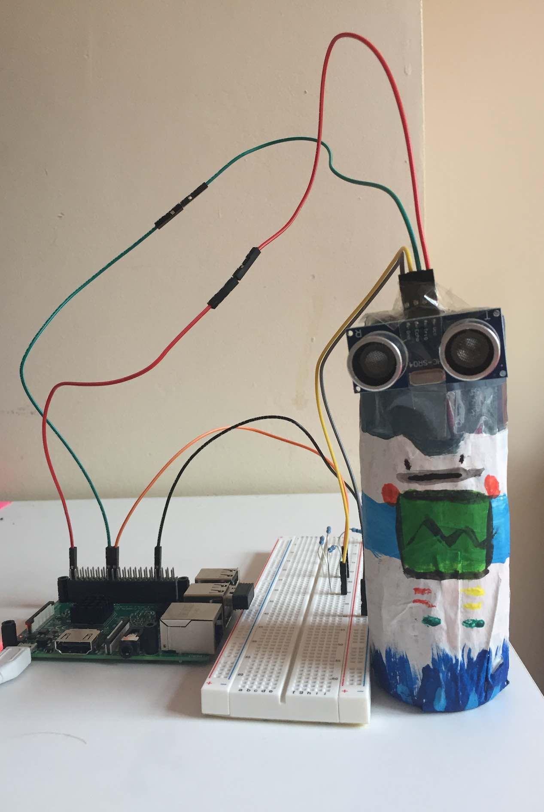

# Playing the ultrasonic sensor sound

## Summary

For this project I used the ultrasonic sensor to obtain information about the distance of an object from the sensor. I then mapped this information into a playable range, and send this to sonic-pi. 



## Description

This project was inspired from [this tutorial](https://projects.raspberrypi.org/en/projects/ultrasonic-theremin).

The ultrasonic sensor is plugged into the Raspberry pi ports and receives 5V power supply. The output signal needs to be converted to 3.3v to not damage the Raspberry pi. 

A useful tutorial on how to assemble the circuit and a slightly different architecture of voltage dividers could be found [here](https://thepihut.com/blogs/raspberry-pi-tutorials/hc-sr04-ultrasonic-range-sensor-on-the-raspberry-pi).

The sonic-pi can be played on the raspberry pi. However, I find easier to play the sonic-pi from my laptop, and this is why the data is sent to a different IP address

## Used hardware
1. Breadboard
2. 3 x  1 Ohm resistor, 1 0 Ohm resistor
3. Ultrasonic sensor
4. Raspberry pi power supply
5. Dupont wires
6. Optional: base for holding your ultrasonic sensor - I recycled an used pepper container and covered it with papier-mâché

### Useful commands to work with the raspberry pi:

- How to transfer files from your computer to the raspberry pi via ssh

```bash
scp -i ~/.ssh/<your-raspberry-pi-private-key>  \
     <path-to-the-origin-file> \
    pi@<ip-of-the-pi>:<path-to-the-destination-folder>
```

## Acknowledgments

Thank you very much to Auro Michele Perego for invaluable suggestions on voltage dividers and scaling techniques. 
 